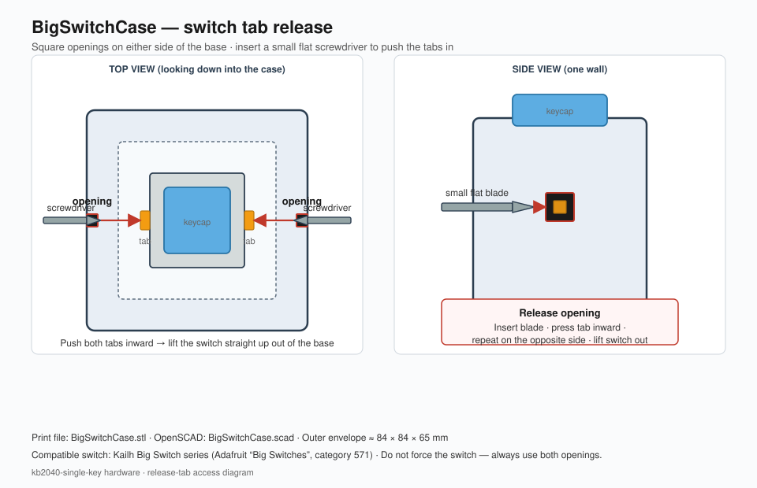

# kb2040-single-key

One key. Many actions. The colour tells you which one.

https://github.com/user-attachments/assets/0918dcb5-c18a-48c0-b888-711ede7c37b0

An [Adafruit KB2040](https://www.adafruit.com/product/5302) with a single **Kailh Big Switch**
and a [NeoPixel Jewel](https://www.adafruit.com/product/2859) under (or beside) it, which
enumerates as a USB keyboard **and** a second USB serial port used only for configuration.
Configuration lives on the board, survives a power cycle, and is edited with a
cross-platform CLI.

Verified on an Adafruit KB2040 running **CircuitPython 10.2.1**. The default profile expects
an eight-pixel chain; with a 7-LED Jewel set `ext_count` to `7` (see
[Build guide](#build-guide)). A full command reference is in
[`docs/kb2040ctl-manual.pdf`](docs/kb2040ctl-manual.pdf).

| Core parts | Link |
|---|---|
| Controller | [Adafruit KB2040 — RP2040 Kee Boar Driver](https://www.adafruit.com/product/5302) |
| Lighting | [NeoPixel Jewel — 7 × 5050 RGB(W)](https://www.adafruit.com/product/2859) (any Jewel variant works) |
| Switch | [Kailh Big Switches](https://www.adafruit.com/category/571) (clicky blue / tactile orange / linear yellow) |
| Case | [`BigSwitchCase.stl`](BigSwitchCase.stl) · [`BigSwitchCase.scad`](BigSwitchCase.scad) |

---

## Bill of materials

### Required electronics

| Qty | Part | Adafruit / source | Notes |
|---:|---|---|---|
| 1 | **Adafruit KB2040** | [product 5302](https://www.adafruit.com/product/5302) · ~$8.95 | RP2040, Pro Micro footprint, USB-C, onboard NeoPixel |
| 1 | **NeoPixel Jewel** (7 LEDs) | [product 2859](https://www.adafruit.com/product/2859) RGBW Natural White, or [2226](https://www.adafruit.com/product/2226) RGB | ~23 mm diameter. Firmware talks plain WS2812 data on `D10` |
| 1 | **Kailh Big Switch** + keycap | [Big Switches category](https://www.adafruit.com/category/571) · ~$19.95 | [5307](https://www.adafruit.com/product/5307) clicky pale blue · [5306](https://www.adafruit.com/product/5306) tactile burnt orange · [5305](https://www.adafruit.com/product/5305) linear dark yellow |
| 1 | USB-C cable | any data-capable cable | Power + HID + config serial |

### Printed / mechanical

| Qty | Part | File | Notes |
|---:|---|---|---|
| 1 | **Big Switch case (base)** | [`BigSwitchCase.stl`](BigSwitchCase.stl) | Outer envelope ≈ **84 × 84 × 65 mm**. Print with the flat base on the bed |
| — | OpenSCAD source | [`BigSwitchCase.scad`](BigSwitchCase.scad) | Mesh polyhedron of the same solid (for inspection / remix) |

Optional: a thin diffuser disk or clear plate under the keycap if you want the Jewel to glow through the switch housing; the stock Kailh Big keycap is opaque, so many builds mount the Jewel in the base looking upward around the switch, or light the desk from under a translucent base.

### Consumables / tools

| Item | Why |
|---|---|
| Hookup wire (or short pre-crimped jumpers) | Switch to `D4`/`GND`; Jewel `DIN`/`5V`/`GND` to `D10`/`RAW`/`GND` |
| Soldering iron + solder | Headers (if used), switch legs, Jewel pads |
| Flux / flush cutters | Clean joints |
| Small flat screwdriver | **Required to release the Big Switch from the case** — see diagram below |
| 3D printer + filament | PLA or PETG for the case |

Rough electronics total (one of each, USD list prices): **≈ $35–40** before shipping, cable, and filament.

---

## Case: tab-release openings

The Big Switch snaps into the printed base. It is **not** meant to be pried out by the keycap.
On opposite sides of the case there are **square openings**. Through each opening you can reach
a plastic **retention tab** on the switch body.

1. Insert a **small flat screwdriver** into the square opening on one side.
2. Push **inward** on the tab (toward the centre of the switch).
3. Repeat on the **opposite** opening.
4. Lift the switch **straight up** out of the base.



> Do not force the housing. If a tab is still caught, go back to that side and push again
> while lifting gently. Forcing the keycap can crack the stem or the printed wall.

---

## Build guide

### 1. Print the case

- Slice [`BigSwitchCase.stl`](BigSwitchCase.stl) (or render [`BigSwitchCase.scad`](BigSwitchCase.scad)).
- Orientation: **flat base on the bed**, openings vertical.
- Suggested start: 0.2 mm layers, 15–20% infill, 3 walls. Supports usually unnecessary if
  printed base-down; enable them only if your slicer flags the openings.
- After printing, clean the two **square side openings** with a knife or small file so a
  screwdriver blade enters cleanly.

### 2. Fit-check the switch (no solder yet)

1. Align the Kailh Big Switch with the cavity (legs/orientation as your wiring prefers —
   note which side the two electrical pins face).
2. Press the switch straight down until both tabs click.
3. Practice the **tab release** with the screwdriver through both square openings so you are
   comfortable removing it before anything is wired.

### 3. Wire the electronics

Follow the [Wiring](#wiring) table. Short summary for this build:

| Connection | From | To |
|---|---|---|
| Switch contact A | Big Switch pin 1 | KB2040 **`D4`** |
| Switch contact B | Big Switch pin 2 | KB2040 **`GND`** |
| LED data | Jewel **`DIN`** (or `In`) | KB2040 **`D10`** |
| LED power | Jewel **`+` / 5V** | KB2040 **`RAW`** (USB 5 V) |
| LED ground | Jewel **`–` / GND** | KB2040 **`GND`** |

```
   KB2040                         NeoPixel Jewel (7)
   ------                         ------------------
   D10  ------------------------>  DIN
   RAW  ------------------------>  +5V
   GND  ------------------------>  GND

   D4   ---[ Kailh Big Switch ]--- GND
```

**Tips**

- Solder the Jewel first if it will sit under the switch — access is harder later.
- Keep the data wire short. If colours glitch, see the [power / 3.3 V data notes](#wiring).
- The onboard NeoPixel needs no wiring; it mirrors status on its own.
- Leave USB-C and the BOOT/RESET buttons accessible (side cutout or open base).

### 4. Install into the case

1. Seat the Jewel (and any diffuser) in the base.
2. Route wires so they do not block a tab or the square openings.
3. Snap the Big Switch in until both tabs catch.
4. Mount or tape the KB2040 in the base (or in a side pocket if you remix the case). USB-C
   should face an opening so the cable does not stress the board.

### 5. Flash firmware and set LED count

1. Install CircuitPython and flash this firmware — [Getting started](#getting-started).
2. For a **7-LED Jewel**, set the external chain length (per active profile):

```bash
kb2040ctl set profiles.0.ext_count 7
kb2040ctl set profiles.1.ext_count 7   # if you use profile 1 as well
```

3. Unplug/replug. On boot you should see the **rainbow sweep** on the onboard pixel and all
   seven Jewel LEDs. Then try a tap and a colour-hold ([The colour tap](#the-colour-tap)).

### 6. Removing the switch later

Use the square openings and a small screwdriver as in
[Case: tab-release openings](#case-tab-release-openings). Pull the switch only after **both**
tabs are free.

---

## The colour tap

A single key can only do one thing — unless you use time and colour as the extra input.

- **Tap** it (press and release quickly) and it fires the profile's **tap** binding.
- **Tap and hold** and, once past the tap window, the LEDs start cycling through colours,
  one per second. Each colour is a **slot**. Let go while a colour is showing and *that*
  slot fires.

The LED is the entire user interface: hold, watch for the colour you want, release.

```
press                                                                 
  |<-- tap window -->|<-- slot 0 --->|<-- slot 1 --->|<-- slot 2 --->|
  |     250 ms       |    1000 ms    |    1000 ms    |    1000 ms    |
  |     (white)      |     (red)     |   (orange)    |   (yellow)    |
  0                 250            1250            2250            3250 ms

  release here...    ...or here      ...or here      ...or here
  -> tap binding     -> slot 0       -> slot 1       -> slot 2
```

`tap_max_ms` (default 250) and `dwell_ms` (default 1000) are per-profile settings.

### Past the last colour

What happens when you keep holding is the per-profile `overflow` setting:

| `overflow` | behaviour |
|---|---|
| `wrap` | back to the first colour, cycling forever. Overshoot is recoverable — keep holding. |
| `wrap_cancel` | as `wrap`, but with one **dark** slot per rotation. Release while the LEDs are off and **nothing fires**. This is the escape hatch. |
| `clamp` | stay on the last colour indefinitely. Forgiving of long holds, but you can never reach an earlier slot without releasing and starting again. |

### What a binding can do

Every binding — the tap and each colour slot — is a **sequence** of steps, run in order:

| step | example | effect |
|---|---|---|
| key | `{ "key": "M", "mods": ["CTRL", "SHIFT"] }` | press with modifiers, then release |
| text | `{ "text": "On my way." }` | type the string |
| media | `{ "consumer": "PLAY_PAUSE" }` | a Consumer Control usage (play/pause, volume, …) |
| delay | `{ "delay_ms": 200 }` | wait before the next step |

So one slot can select-all-and-copy, another can type a canned reply and press Enter, and
another can mute your microphone.

### Profiles

The board stores several complete configurations and one is active at a time. Switch with
`kb2040ctl profile use 1`. Profiles are uploaded and downloaded as JSON, so you can keep as
many on disk as you like.

## Out of the box

The factory configuration has two profiles. Profile 0, `colors`, is active and is
deliberately self-describing:

| Gesture | Colour | Action |
|---|---|---|
| tap | white | **Print Screen** |
| hold → release on slot 0 | red | types `Red` |
| hold → release on slot 1 | orange | types `Orange` |
| hold → release on slot 2 | yellow | types `Yellow` |
| hold → release on slot 3 | green | types `Green` |
| hold → release on slot 4 | cyan | types `Cyan` |
| hold → release on slot 5 | blue | types `Blue` |
| hold → release on slot 6 | violet | types `Violet` |
| hold → release on slot 7 | magenta | types `Magenta` |

One slot per LED in the default eight-pixel chain, in the same order the startup rainbow
sweeps them. Because each slot types the name of the colour it is showing, the gesture
teaches itself: hold, watch the strip, release, and the word that appears tells you whether
you let go when you meant to.

Profile 1, `media`, is play/pause on tap with mute, volume and track controls on the colour
slots — switch to it with `kb2040ctl profile use 1`.

---

## Wiring

Reference hardware for this repo is the **KB2040 + Kailh Big Switch + NeoPixel Jewel**
build described in the [Bill of materials](#bill-of-materials) and
[Build guide](#build-guide). Any momentary switch to ground and any WS2812-compatible chain
on `D10` will work the same electrically.

| Function | Pin | Notes |
|---|---|---|
| Key switch (Kailh Big Switch) | `D4` (GP4) | other leg to `GND`. Internal pull-up, active low — no resistor needed. |
| Onboard NeoPixel | `NEOPIXEL` (GP17) | already on the board, nothing to wire |
| External WS2812 data (Jewel `DIN`) | `D10` (GP10) | first pixel's `DIN` |
| External WS2812 power | `RAW` (5 V) and `GND` | see the power note below |

```
   KB2040                      WS2812 chain / NeoPixel Jewel
   ------                      -----------------------------
   D10  --------------------->  DIN
   RAW  --------------------->  5V
   GND  --------------------->  GND
                                 |
   D4   ---[ key switch ]--- GND |
```

**Power.** A WS2812 draws up to ~60 mA at full white. `RAW` comes straight from USB VBUS, so
the practical ceiling is what the host port will give — budget roughly 8–10 pixels before
adding a separate 5 V supply (tie its ground to the board's). A 7-LED Jewel is well inside
that. The default `brightness` of 64 keeps a chain of 7–8 to about a fifth of full-white draw.

**3.3 V data into a 5 V part.** The RP2040's output is 3.3 V and WS2812 datasheets ask for
0.7 × VDD. It usually works at short distances, and reliably if you power the chain at
4.5 V or use WS2812B-family parts. If the first pixel flickers or shows wrong colours, that
is the reason — add a level shifter or drop the strip supply.

To use different pins, change `KEY_PIN` and `EXT_PIN` at the top of `src/code.py`.

---

## Getting started

### 1. Put CircuitPython on the board

Skip this if the board already shows up as a `CIRCUITPY` drive.

Get it into the UF2 bootloader so an `RPI-RP2` drive appears:

- **double-tap RESET** quickly, or
- **hold BOOT while tapping RESET** (or while plugging the USB cable in), or
- if the board is running an **Arduino** sketch, the double-tap often does nothing — use the
  standard Arduino *1200-baud touch* instead: open its serial port at 1200 baud and close
  it, and it reboots into the bootloader.

Then copy the [KB2040 CircuitPython build](https://circuitpython.org/board/adafruit_kb2040/)
onto `RPI-RP2`. The board reboots as `CIRCUITPY`.

> **Get the board-specific build.** Nothing on the bootloader drive identifies the board —
> `INFO_UF2.TXT` always reads `Model: Raspberry Pi RP2`, because the bootloader lives in the
> RP2040's mask ROM and is identical on every RP2040. The `.uf2` is what defines
> `board.NEOPIXEL`, `board.D4` and `board.D10`, so the wrong one breaks exactly the pins this
> firmware uses. Once CircuitPython is on, `boot_out.txt` names the board for real.

### 2. Flash the firmware

```powershell
pip install -r requirements-dev.txt
pwsh scripts/flash.ps1          # Windows
```

```bash
pip install -r requirements-dev.txt
scripts/flash.sh                # macOS and Linux
```

Both install the CircuitPython libraries with `circup` and copy `src/` onto the drive. If the
volume is mounted somewhere unusual — common on headless Linux, which may not automount at
all — pass it explicitly: `scripts/flash.sh --drive /mnt/CIRCUITPY`.
Then **unplug and replug the board** — `boot.py` only takes effect on a hard reset, and it
is what creates the second serial port.

On every start the board runs a **rainbow sweep** across the onboard NeoPixel and the whole
external chain, then settles into the profile's idle animation. That is the self-test: if
all your pixels light and show a smooth spread of colour, the data line, the chain length
and the power are all good. It runs regardless of the profile's `idle_mode` and stays
visible even at `brightness: 0`, because it is the only diagnostic the board has before
anything can talk to it.

### 3. Build the CLI

```bash
go build -o kb2040ctl ./cli/cmd/kb2040ctl
```

Or download a prebuilt binary from the releases page — Windows, macOS and Linux, amd64 and
arm64, no runtime to install.

Two per-platform notes, both covered in the [manual](docs/kb2040ctl-manual.pdf): macOS
quarantines a downloaded binary, so clear it with
`xattr -d com.apple.quarantine ./kb2040ctl`; and on Linux `/dev/ttyACM*` belongs to the
`dialout` group, so `sudo usermod -aG dialout "$USER"` (then log out and in) avoids
*permission denied*.

### 4. Check it

```console
$ kb2040ctl ports
   COM27        USB Serial Device (COM27)  [USB 239A:8106]
-> COM28        USB Serial Device (COM28)  [USB 239A:8106]
   COM3         Standard Serial over Bluetooth link (COM3)

$ kb2040ctl info
port       COM28
firmware   0.1.0 (format 1)
storage    204 / 4096 bytes used (3892 free)

* 0  colors           8 slots, 1000ms dwell, wrap overflow, 8 LEDs
  1  media            6 slots, 1000ms dwell, wrap_cancel overflow, 8 LEDs
```

Two ports appear because the board exposes both the REPL console and the config port
(`COM27`/`COM28` on Windows, `/dev/ttyACM0`/`/dev/ttyACM1` on Linux, `/dev/cu.usbmodem*` on
macOS). They have identical USB IDs, so `kb2040ctl` finds the right one by asking each until
one answers. Bluetooth ports are never probed — opening an idle one on Windows can block for
minutes — and on macOS only the `/dev/cu.*` names are tried, since opening a `/dev/tty.*`
twin waits forever for carrier detect.

---

## Configuring

### Edit one thing

```bash
kb2040ctl set profiles.0.dwell_ms 1500
kb2040ctl set profiles.0.slots.2.color "#00FF80"
kb2040ctl set profiles.0.slots.0.steps.0.text "Back in five."
kb2040ctl get profiles.0.overflow
```

`set` downloads the configuration, applies the edit, validates it and uploads the result —
the board is only ever written whole, so a half-applied configuration is not possible.

### Edit a file

```bash
kb2040ctl download -o mine.json     # whole device
$EDITOR mine.json
kb2040ctl validate mine.json        # check it without a board attached
kb2040ctl upload mine.json
```

Or one profile at a time:

```bash
kb2040ctl download -p 0 -o media.json
kb2040ctl upload -p 1 examples/meetings.json
```

### Tune the timing by feel

```console
$ kb2040ctl watch
Watching. Tap and hold the key; press Ctrl-C to stop.
press
slot 0 FF0000
slot 1 FF6000
slot 2 FFC000
release
fire 3
```

If you keep overshooting, raise `dwell_ms`. If a deliberate tap keeps landing on slot 0,
raise `tap_max_ms`.

---

## Command reference

| Command | What it does |
|---|---|
| `kb2040ctl ports` | list serial ports and show which one is the board |
| `kb2040ctl info` | show firmware version, storage use and the active profile |
| `kb2040ctl download [-p N] [-o FILE]` | save the device's configuration as JSON |
| `kb2040ctl upload [-p N] FILE` | send a JSON configuration to the device |
| `kb2040ctl get PATH` | print one value from the device's configuration |
| `kb2040ctl set PATH VALUE` | change one value and upload the result |
| `kb2040ctl profile list\|use N` | list profiles or switch the active one |
| `kb2040ctl test PROFILE BINDING` | fire a binding now (binding 0 is the tap) |
| `kb2040ctl watch` | print key and colour-slot events live |
| `kb2040ctl validate FILE` | check a configuration file without a device |
| `kb2040ctl defaults` | restore the factory configuration |
| `kb2040ctl keys [media]` | list the key and media names a config can use |
| `kb2040ctl version` | print this tool's version |

Every command that talks to the board takes `-port COM7` (or `/dev/ttyACM1`) to skip
autodetection. `validate`, `keys` and `version` need no board at all.

---

## Configuration format

```jsonc
{
  "format": 1,
  "active": 0,
  "profiles": [
    {
      "name": "media",          // up to 16 bytes
      "dwell_ms": 1000,         // 100..10000 - how long each colour shows
      "tap_max_ms": 250,        // 20..2000  - release under this is a tap
      "overflow": "wrap",       // wrap | wrap_cancel | clamp
      "ext_count": 8,           // 0..64 external WS2812s, 0 disables the chain
      "brightness": 64,         // 0..255
      "idle_mode": "breathe",   // off | solid | breathe | rainbow
      "idle_color": "#001018",
      "tap":   { "color": "#FFFFFF", "steps": [ { "consumer": "PLAY_PAUSE" } ] },
      "slots": [                // 1..16 colour slots, in cycle order
        { "color": "#FF0000", "steps": [ { "consumer": "MUTE" } ] },
        { "color": "#00FF00", "steps": [ { "text": "brb" },
                                         { "delay_ms": 200 },
                                         { "key": "ENTER" } ] }
      ]
    }
  ]
}
```

A step sets exactly one of `key`, `text`, `consumer` or `delay_ms`. `mods` only accompanies
`key`, and accepts `CTRL`, `SHIFT`, `ALT`, `GUI` (also `WIN`/`CMD`), and the `R`-prefixed
right-hand forms.

Run `kb2040ctl keys` for every key name and `kb2040ctl keys media` for the media names.

Working examples are in [`examples/`](examples/): `default.json` (the factory
configuration), `dev-hotkeys.json` and `meetings.json`.

### The byte budget

Everything lives in the RP2040's 4096-byte non-volatile region, which is what lets the
configuration persist while the `CIRCUITPY` drive stays writable from your PC. There is no
fixed per-profile limit — spend the space how you like:

```console
$ kb2040ctl validate mine.json
mine.json is valid: 3 profile(s), 620 / 4096 bytes (3476 free)
  0  colors           8 slots, 115 bytes
  1  media            6 slots, 73 bytes
  2  meetings         4 slots, 169 bytes
```

An upload that would not fit is refused before anything is sent, and refused again by the
board. Roughly: a slot with a short key or media action costs about 8 bytes, and a slot with
a typed sentence costs about 6 bytes plus the length of the text.

---

## Troubleshooting

**Only one serial port appears.** `boot.py` has not run. It only takes effect on a *hard*
reset — unplug and replug, or press the reset button. A soft reload is not enough.

**`no kb2040-single-key found on any of: ...`** Either the board is not running this
firmware, or something else already has the port open (a serial monitor, the Mu editor).
Close it and try again, or pass `-port` explicitly.

**`kb2040ctl info` reports a `status` that is not `ok`.** The board could not read its
stored configuration and fell back to the factory defaults; the status says why (`blank` on
a board that has never been configured, `corrupt: ...` otherwise). Uploading a configuration
clears it.

**No `CIRCUITPY` drive at all.** The board is not running CircuitPython — it may still have
whatever firmware came on it. Go back to step 1. A board running an Arduino sketch enumerates
as a single serial port with no drive, and its USB vendor ID is `2E8A` (Raspberry Pi) rather
than Adafruit's `239A`.

**No startup rainbow at all.** The firmware is not running. Check the REPL on the *console*
serial port for a traceback — a missing library (`adafruit_hid`, `neopixel`) is the usual
cause, so re-run `scripts/flash.ps1` without `-SkipLibraries`.

**Startup rainbow on the onboard pixel but not the chain.** Either `ext_count` is 0
(`kb2040ctl get profiles.0.ext_count`) or the chain is not receiving data — check `D10` to
the *first* pixel's `DIN`, and that the strip's ground is tied to the board's.

**Only some of the chain lights during the startup rainbow.** `ext_count` is smaller than
the number of pixels you attached. `kb2040ctl set profiles.0.ext_count 8`.

**The key does nothing but the LEDs work.** The switch is not reaching `D4`/`GND`. Check with
`kb2040ctl watch` — no `press` line means the firmware never sees the key.

**The LEDs work but the key types the wrong thing.** Fire the binding directly with
`kb2040ctl test 0 3` to separate a wiring/timing problem from a configuration problem.

---

## Development

```bash
python -m pytest tests -q     # firmware logic - no hardware needed
go test ./cli/...             # CLI and wire format
go vet ./cli/...
```

The manual is built from [`docs/manual.md`](docs/manual.md):

```bash
python scripts/build-manual.py    # -> docs/kb2040ctl-manual.pdf
```

Everything under `src/singlekey/` deliberately imports nothing from CircuitPython, so the
gesture state machine, LED engine, binary codec, Ascii85 codec and serial protocol all run
under host pytest. Only `src/boot.py` and `src/code.py` touch hardware, and a test enforces
that boundary.

The binary format and serial protocol are specified in [`docs/format.md`](docs/format.md),
which is authoritative for both implementations. They are pinned together by golden vectors
in `tests/fixtures/`, generated by the Go encoder and asserted byte-for-byte by the Python
tests — change one side without the other and CI fails.

After an intentional format change:

```bash
go test ./cli/... -update     # regenerate tests/fixtures and examples/default.json
python -m pytest tests -q     # confirm the firmware agrees
```

Planning and progress notes live in [`plan.md`](plan.md).
